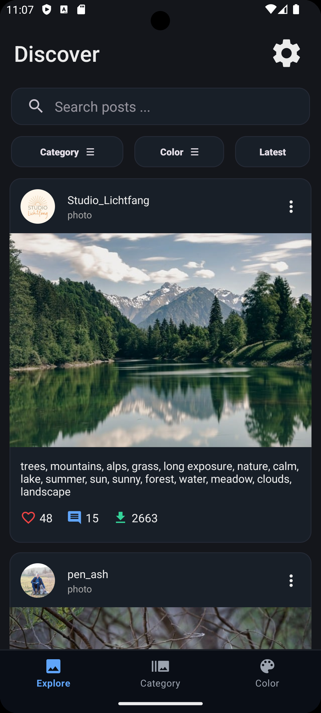
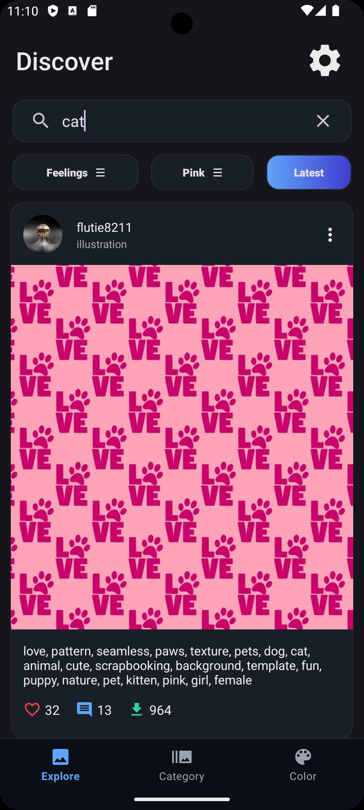
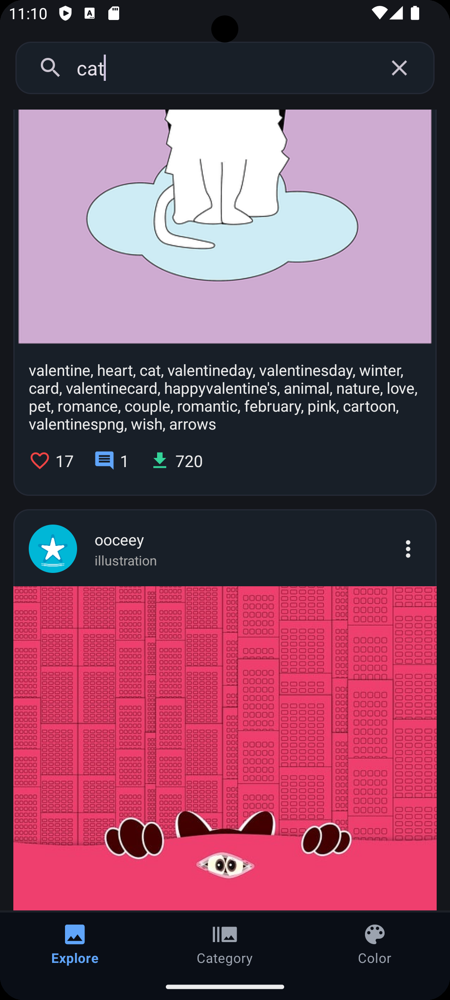
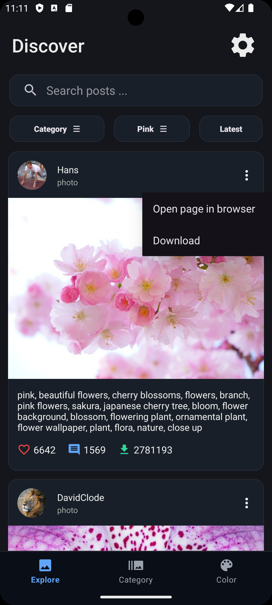
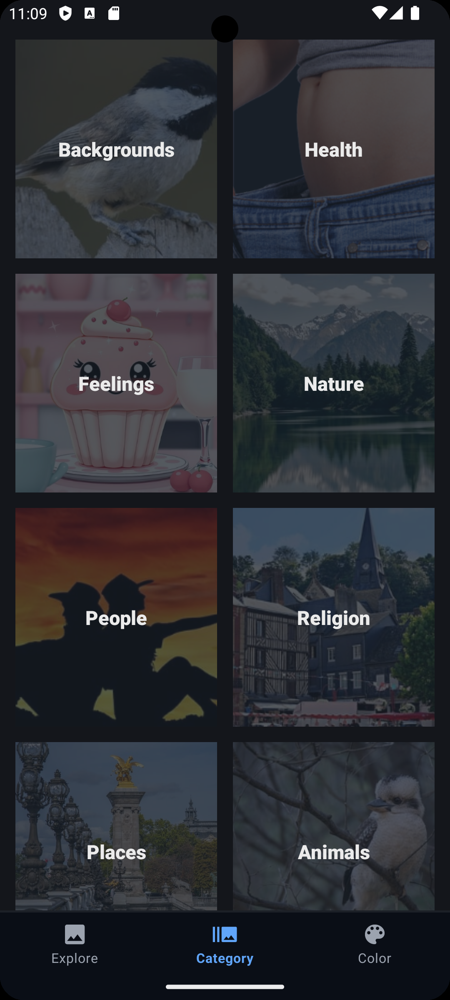
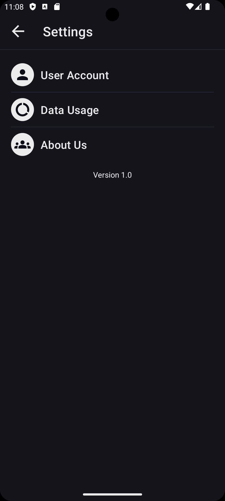

[](https://github.com/ahmadrezagh671/Pixabay_Android_App/releases)

# Pixabay_Android_App

An Android application that uses the [Pixabay API](https://pixabay.com/api/docs/) to browse, search, and download images.

## ✨ Features

- 🔍 Search images using keywords  
- 🎨 Filter images by category and color  
- ⬇️ Download images  
- 🔄 Swipe to refresh content  
- 🔍 Pinch-to-zoom on image previews  
- 💾 Efficient image loading and caching  
- 📱 Responsive UI 

## 📦 Libraries Used

- [Volley](https://developer.android.com/training/volley) – Networking
- [Gson](https://github.com/google/gson) – JSON parsing
- [Glide](https://github.com/bumptech/glide) – Image loading
- [AndroidX SwipeRefreshLayout](https://developer.android.com/reference/androidx/swiperefreshlayout/widget/SwipeRefreshLayout) – Pull to refresh
- [CircleImageView](https://github.com/hdodenhof/CircleImageView) – Circular images
- [Zoomy](https://github.com/imablanco/Zoomy) – Image zoom gestures
- [Flexbox Layout](https://github.com/google/flexbox-layout) – Flexible UI design

## 📸 Screenshots

|  |  |  |
|-----------------------------------------|-----------------------------------------|-----------------------------------------|
|  |  |  |

## 🚀 Getting Started

### Prerequisites

- Android Studio 
- Minimum SDK: 28 (Android 9)

### How to Run

1. Clone the repository:
   ```bash
   git clone https://github.com/ahmadrezagh671/Pixabay_Android_App.git
   ```
3. Open the project in Android Studio.
4. Add your [Pixabay API](https://pixabay.com/api/docs/) key in local.properties:
   ```properties
   Pixabay_API_KEY=371469............34f606
   ```
5. Build and run the app on an emulator or device.

## 📄 License
This project is licensed under the MIT License - see the [LICENSE](https://github.com/ahmadrezagh671/Pixabay_Android_App/blob/main/LICENSE) file for details.
