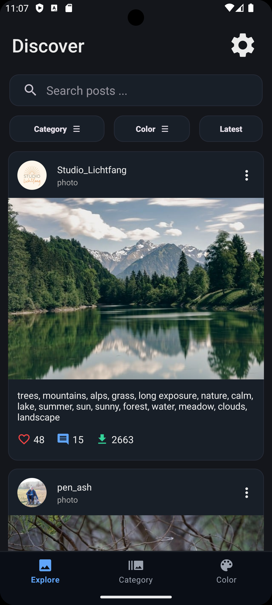
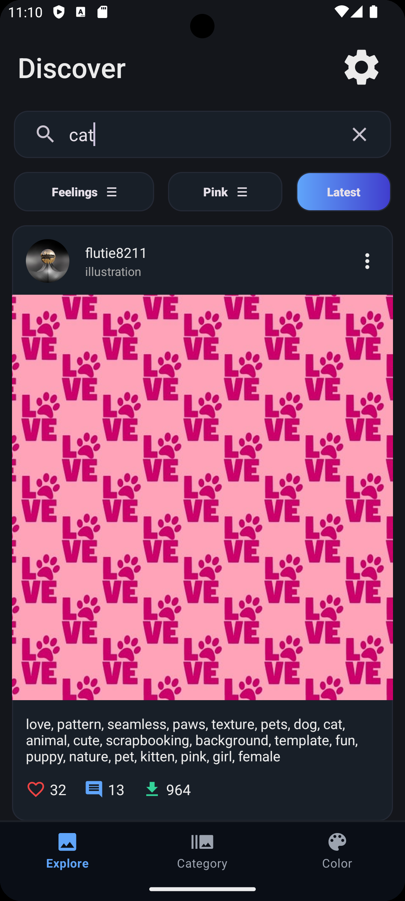
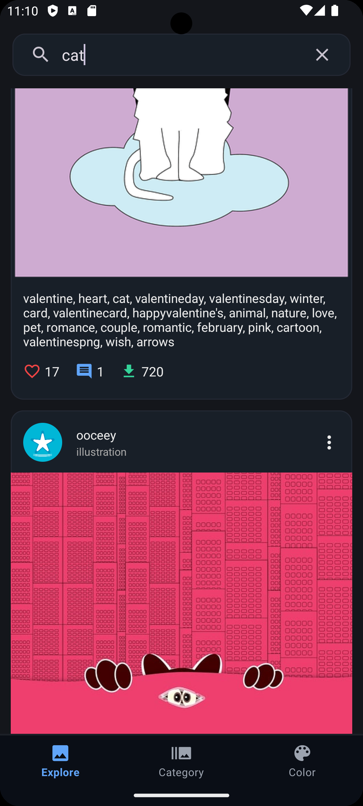
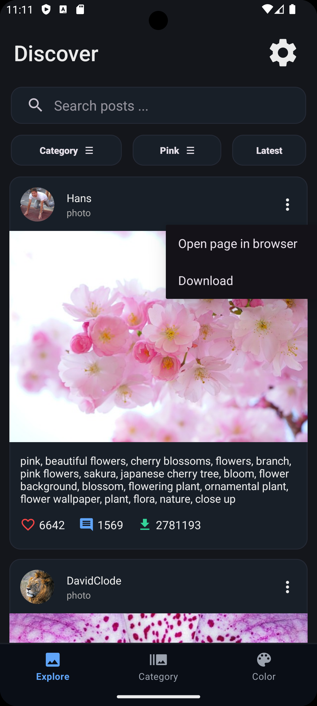
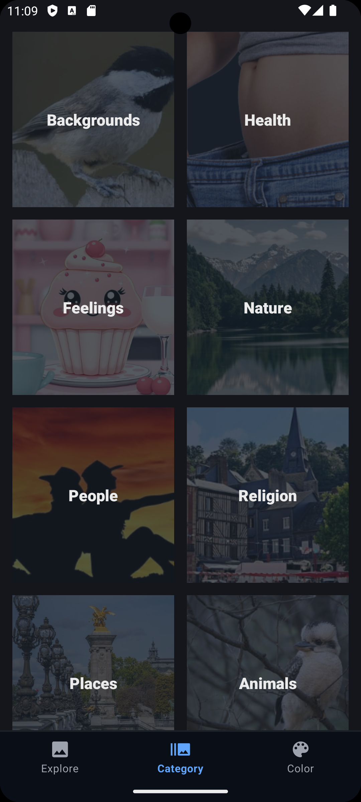
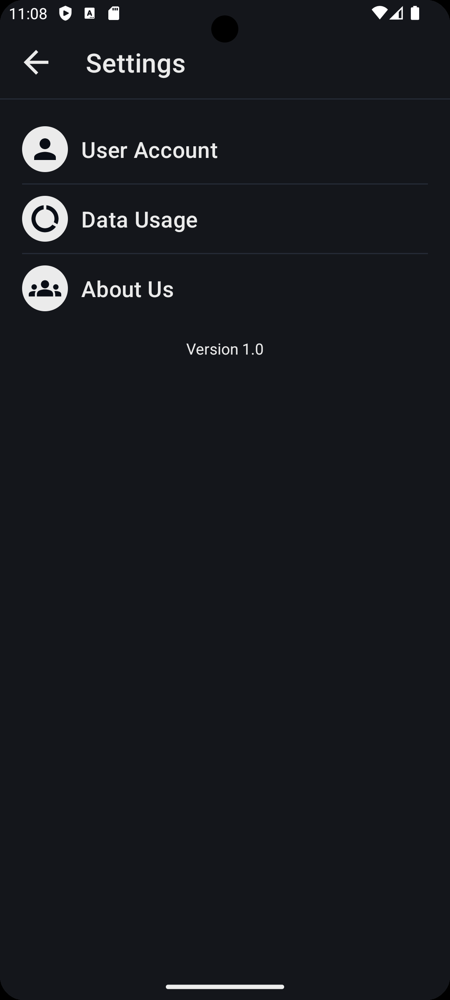

# Pixabay Android App Free Stock Photo Search & Download App for Android

[](https://github.com/ahmadrezagh671/Pixabay_Android_App/releases)
[![IzzyOnDroid Yearly Downloads](https://img.shields.io/badge/dynamic/json?url=https://dlstats.izzyondroid.org/iod-stats-collector/stats/basic/yearly/rolling.json&query=$.[%27com.ahmadrezagh671.pixabay%27]&label=Download&logo=)](https://apt.izzysoft.de/packages/com.ahmadrezagh671.pixabay)
[](https://apt.izzysoft.de/packages/com.ahmadrezagh671.pixabay)
[](https://github.com/ahmadrezagh671/Pixabay_Android_App/blob/main/LICENSE)
[](https://github.com/ahmadrezagh671/Pixabay_Android_App)
[](https://github.com/ahmadrezagh671/Pixabay_Android_App)

**Pixabay Android App** is a free, open-source Android application for searching, browsing, and downloading **free stock photos and images** from the [Pixabay API](https://pixabay.com/api/docs/). Built natively for Android with a clean, responsive UI, this app makes it easy to find royalty-free images by keyword, category, or color, and save them directly to your device.

Whether you're a designer, developer, content creator, or just looking for a lightweight open-source Pixabay client for Android, this project is a great starting point or ready-to-use app.

---

## 📑 Table of Contents

- [Features](#-features)
- [Screenshots](#-screenshots)
- [Tech Stack & Libraries](#-tech-stack--libraries)
- [Installation](#-installation)
- [Getting Started (Build from Source)](#-getting-started-build-from-source)
- [Download](#-download)
- [Privacy & Analytics](#-privacy--analytics)
- [Attribution](#-attribution)
- [Contributing](#-contributing)
- [License](#-license)

---

## ✨ Features

- 🔍 **Keyword Image Search**: find free stock photos instantly using the Pixabay API
- 🎨 **Filter by Category & Color**: narrow down search results for the perfect image
- ⬇️ **One-Tap Image Download**: save high-quality images directly to your device
- 🔄 **Pull-to-Refresh**: swipe to refresh search results and image feeds
- 🔍 **Pinch-to-Zoom Preview**: inspect images closely before downloading
- 💾 **Efficient Image Caching**: fast loading with smart caching for smooth browsing
- 📱 **Responsive, Modern UI**: adapts cleanly across different Android screen sizes
- 🆓 **100% Free & Open Source**: no ads, no paywalls, MIT licensed

---

## 📸 Screenshots

|  |  |  |
|---|---|---|
|  |  |  |

---

## 🧱 Tech Stack & Libraries

This app is built using standard, well-maintained Android libraries:

| Library | Purpose |
|---|---|
| [Volley](https://developer.android.com/training/volley) | Networking & API requests |
| [Gson](https://github.com/google/gson) | JSON parsing |
| [Glide](https://github.com/bumptech/glide) | Image loading & caching |
| [AndroidX SwipeRefreshLayout](https://developer.android.com/reference/androidx/swiperefreshlayout/widget/SwipeRefreshLayout) | Pull-to-refresh functionality |
| [CircleImageView](https://github.com/hdodenhof/CircleImageView) | Circular image views |
| [Zoomy](https://github.com/imablanco/Zoomy) | Pinch-to-zoom gestures |
| [Flexbox Layout](https://github.com/google/flexbox-layout) | Flexible, responsive UI layouts |
| [Firebase Analytics](https://firebase.google.com/docs/analytics) | Anonymous, aggregated usage analytics |

---

## 📥 Installation

Download the latest APK directly from the [Releases page](https://github.com/ahmadrezagh671/Pixabay_Android_App/releases), or install it from:

- [IzzyOnDroid](https://apt.izzysoft.de/packages/com.ahmadrezagh671.pixabay)

**Requirements:** Android 9.0 (API 28) or higher.

---

## 🚀 Getting Started (Build from Source)

### Prerequisites

- Android Studio (latest stable version recommended)
- Minimum SDK: 28 (Android 9)
- A free [Pixabay API key](https://pixabay.com/api/docs/)

### Steps

1. **Clone the repository:**
   ```bash
   git clone https://github.com/ahmadrezagh671/Pixabay_Android_App.git
   ```

2. **Open the project** in Android Studio.

3. **Add your Pixabay API key** to `local.properties`:
   ```properties
   Pixabay_API_KEY=your_api_key_here
   ```

4. **Build and run** the app on an emulator or a physical device.

---

## 🔒 Privacy & Analytics

This app uses **Firebase Analytics** to collect anonymous, aggregated usage data (e.g. screen views, general usage patterns) to help improve the app. No personally identifiable information is intentionally collected.

Firebase Analytics is provided by Google and subject to [Google's Privacy Policy](https://policies.google.com/privacy). If you distribute your own fork publicly, you should publish your own privacy policy describing this data collection.

To remove Firebase Analytics: delete the `firebase-analytics` dependency and `com.google.gms.google-services` plugin in `app/build.gradle.kts`, and remove `app/google-services.json`.

## 📌 Attribution

This is an independent, non-commercial client for the [Pixabay API](https://pixabay.com/api/docs/) and is **not affiliated with or endorsed by Pixabay**.

All images and metadata retrieved through the app belong to their respective Pixabay contributors and are subject to the [Pixabay Content License](https://pixabay.com/service/license-summary/).

See [THIRD_PARTY_NOTICES.md](THIRD_PARTY_NOTICES.md) for the full list of third-party libraries and licenses used in this project.

---

## 🤝 Contributing

Contributions, issues, and feature requests are welcome! Feel free to check the [issues page](https://github.com/ahmadrezagh671/Pixabay_Android_App/issues) or open a pull request.

1. Fork the project
2. Create your feature branch (`git checkout -b feature/AmazingFeature`)
3. Commit your changes (`git commit -m 'Add some AmazingFeature'`)
4. Push to the branch (`git push origin feature/AmazingFeature`)
5. Open a Pull Request

---

## 📄 License

This project is licensed under the **MIT License** - see the [LICENSE](https://github.com/ahmadrezagh671/Pixabay_Android_App/blob/main/LICENSE) file for details.
